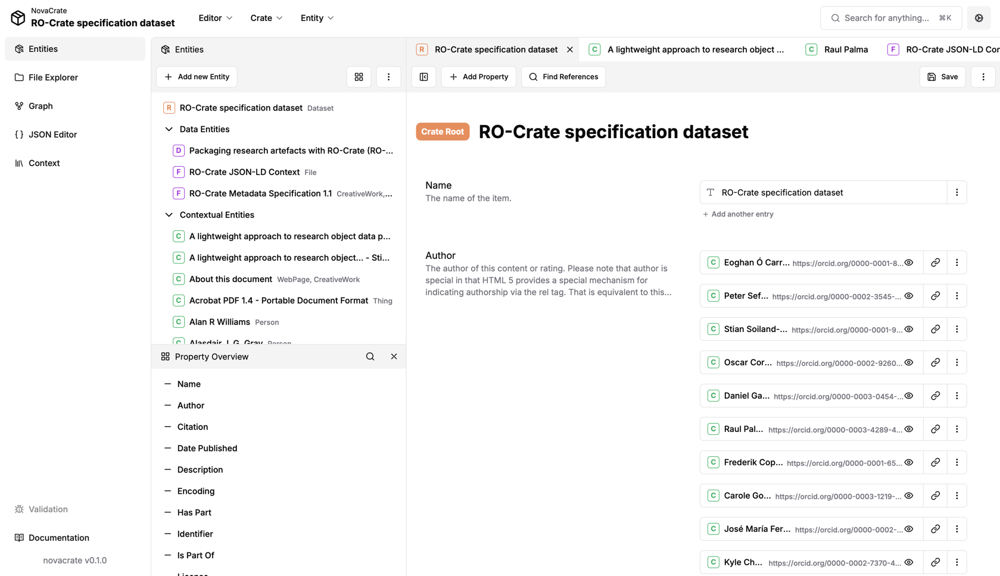
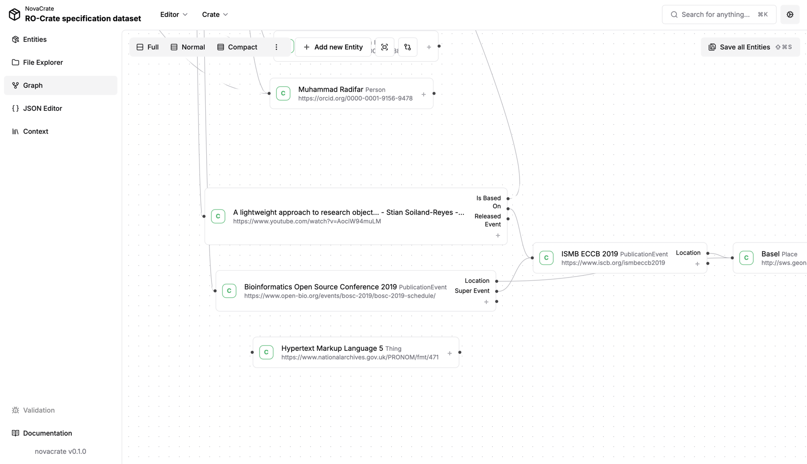

# NovaCrate

Web-based interactive editor for **creating, editing and visualising** research object crates. Currently requires
to run a separate backend to allow manipulating ro-crates on the local hard drive. The editor can be extended to work with any local or 
distributed back-end.





## Installation

### Prerequisites

- Clone and install [ro-crate-rest](https://gitlab.kit.edu/kit/scc/dem/dem-students/ChristopherR/implementation/ro-crate-rest), make sure it is running
- Install Node.js >= 20
- Clone the NovaCrate repository

### Quickstart

Once the prerequisites are met, run the following code to get started quickly:

```bash
npm install
npm run dev
```

### Updating dependencies

This step might be necessary after fetching new commits and on the first installation.

```bash
npm install
```


### Development

This command starts NovaCrate in development mode. This enabled hot reload, but also increases response time

```bash
npm run dev
```

Open [http://localhost:3000](http://localhost:3000) with your browser to see the result.

### Building

This command builds NovaCrate in the `out` folder.

```bash
npm run build
```

The website can then be found in the `out` folder. Use any web server for viewing. Local viewing:

```bash
npx serve@latest out
```

## Thesis

This project was created as part of a [bachelor thesis](https://doi.org/10.5445/IR/1000178790)

## Structure

Most of the structure of the editor and many implementation and design details are outlined in the bachelors thesis.

To summarize: This is a Next.js app. Pages are located in /app, components in /components and anything else is probably in /lib


## Tauri Integration

Initial tests with tauri, to turn NovaCrate into a desktop app, were successful. Sources can be found in the src-tauri folder.
