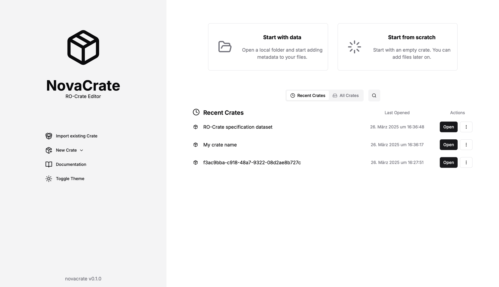

# 📦 NovaCrate

Web-based interactive editor for **creating, editing and visualising** research object crates. The editor can be extended to work with any local or 
remote backend.

## [▶️ Demo](https://kit-data-manager.github.io/NovaCrate/)

> If you can't access the demo, there are screenshots of NovaCrate at the bottom of this README

## 🎨 Editions

NovaCrate can be used and deployed in multiple different ways. Currently, the following editions (conceptually) exist:

| Name               | Status                 | Description                                                                                                                                                                                                             | Notes                                                                                                      |
|--------------------|------------------------|-------------------------------------------------------------------------------------------------------------------------------------------------------------------------------------------------------------------------|------------------------------------------------------------------------------------------------------------|
| Standalone Web App | Active                 | Standalone Web App without a backend. Stores Crates in the local origin-private file system of the browser                                                                                                              | [Access here](https://kit-data-manager.github.io/NovaCrate/)                                               |
| Desktop App        | Not maintained         | Tauri App with a local backend. Has full access to file system and can make use of arbitrary backend software.                                                                                                          | See `src-tauri`                                                                                            |
| Cloud Frontend     | Currently out of scope | NovaCrate is a frontend that can be used with any compatible backend solution, for example a cloud based service that hosts RO-Crates. This approach has not been explored yet due to lack of viable backend solutions. | See `src/lib/backend/CrateServiceAdapter.ts` for a list of methods that a backend adapter should implement |

### ℹ️ How To: Custom Backend

NovaCrate is a frontend that can be used for any backend that hosts RO-Crates (an appropriate backend adapter must be implemented). This could be anything in the range from a simple file storage to a full REST Service for manipulating crates.
See `src/lib/backend/CrateServiceAdapter.ts` for a list of methods that a backend adapter should implement. All of these methods can make use of backend resources or be suplemented locally.

NovaCrate currently does not include mechanisms for authentication, access control or concurrent access.

## 📊 Roadmap

- ✅ Create, read and edit RO-Crates
- ✅ Visualize RO-Crates with a graph
- ✅ Context-information and property descriptions
- ✅ Automatic recommendation of fitting entity types and properties
- ✅ Focused on good usability
- ✅ Support RO-Crate Specification v1.1
- ✅ Support for importing and exporting the ELN format
- ✅ Generate HTML preview file in crate
- ❌ Validation of RO-Crates
- ❌ Support for RO-Crate Profiles

## 👨‍💻 Development

### Prerequisites

- Install Node.js >= 20
- Clone the NovaCrate repository

### Quickstart

Once the prerequisites are met, run the following code to get started quickly:

```bash
npm install
npm run dev
```

### Updating dependencies

This step might be necessary after fetching new commits and on the first installation.

```bash
npm install
```


### Development

This command starts NovaCrate in development mode. This enabled hot reload, but also increases response time

```bash
npm run dev
```

Open [http://localhost:3000](http://localhost:3000) with your browser to see the result.

### Building

This command builds NovaCrate in the `out` folder.

```bash
npm run build
```

The website can then be found in the `out` folder. Use any web server for viewing. Local viewing:

```bash
npx serve@latest out
```

## 🎓 Thesis

This project was first created as part of a [bachelor thesis](https://doi.org/10.5445/IR/1000178790)

## ℹ️ Structure

Most of the structure of the editor and many implementation and design details are outlined in the bachelor thesis.

To summarize: This is a Next.js app. Pages are located in /app, components in /components and anything else is probably in /lib.

## 📸 Screenshots


