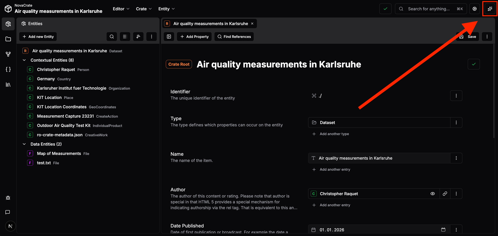
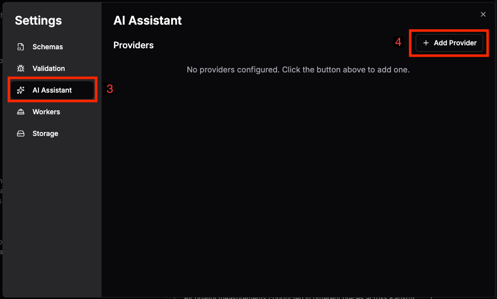
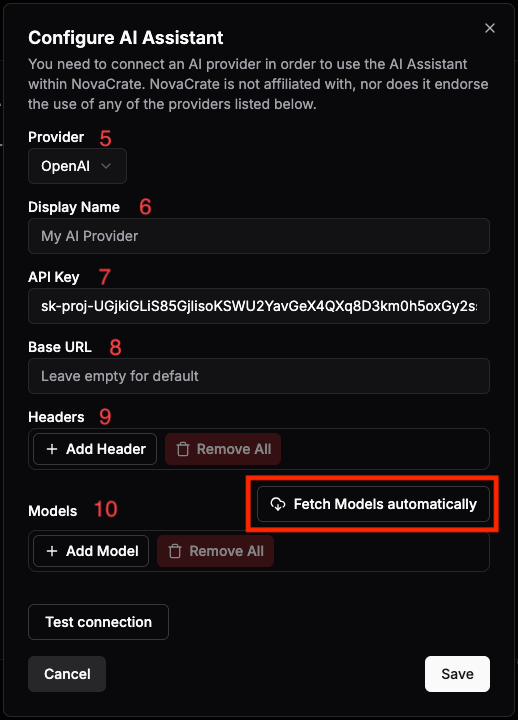
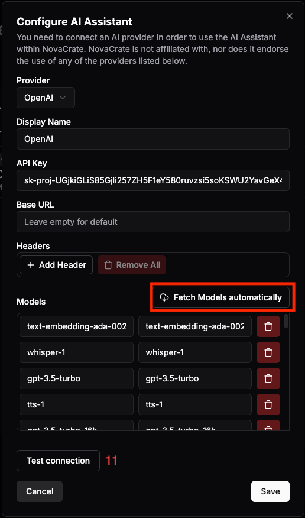

This document is targeted at NovaCrate users that want to make use of the integrated AI Assistant.

# Opening the AI Assistant within NovaCrate

The AI Assistant can be opened and closed by clicking the "sparkle" icon in the top right of the editor.

# Setting up the AI Assistant within NovaCrate

1. An RO-Crate has to be open for the following steps. 
2. Open the settings by clicking the cog icon in the top right.
3. In the settings sidebar, open the "AI Assistant" page. You can manage existing providers and create new ones here.
4. Click on the "Add Provider" button. You should now see the following popup:

    

5. Use a provider of your choice. You need an active subscription with OpenAI or Anthropic to use them OpenRouter provides a small selection of free models, but a registration is required to obtain an API key. You can also configure your own OpenAI-compatible provider, if you have access to one.
6. (Optional) Set the display name of the provider.
7. You need to provide an API Key for all providers. The process of getting this API Key depends on your selected provider.
8. The Base URL only needs to be configured for the OpenAI-compatible provider. Leave it empty otherwise
9. Custom headers can be set up here. This is rarely required.
10. The models available to the AI Assistant are configured here. It is recommended to fetch these models automatically using the provided button. For this to work, you need to complete the steps above (select a provider and provide an API Key).

   

   Some models are not suitable for being used in the AI Assistant (e.g. image/audio/video generation). Feel free to delete all models from the list you do not intend to use. You can always re-fetch all available models.

11. Test the connection to the AI provider before saving. If the test fails, you may have incorrectly copied the API Key or selected the wrong provider.
12. When the connection is established successfully, click the "Save" button.

This concludes the setup tutorial for the AI Assistant. You can now use the AI Assistant within NovaCrate. It can be opened using the "sparkle" icon in the top right of the editor.