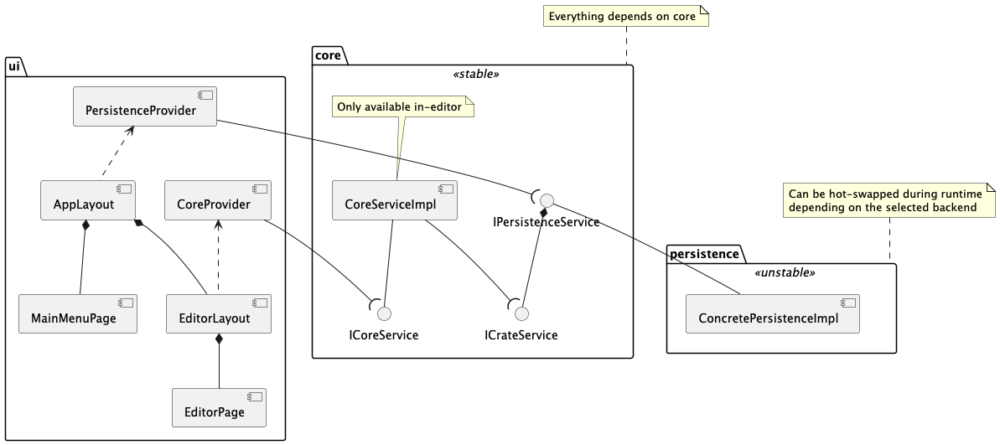
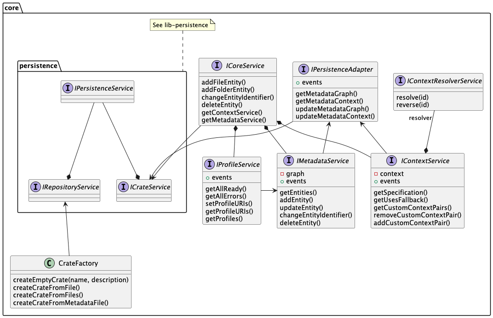
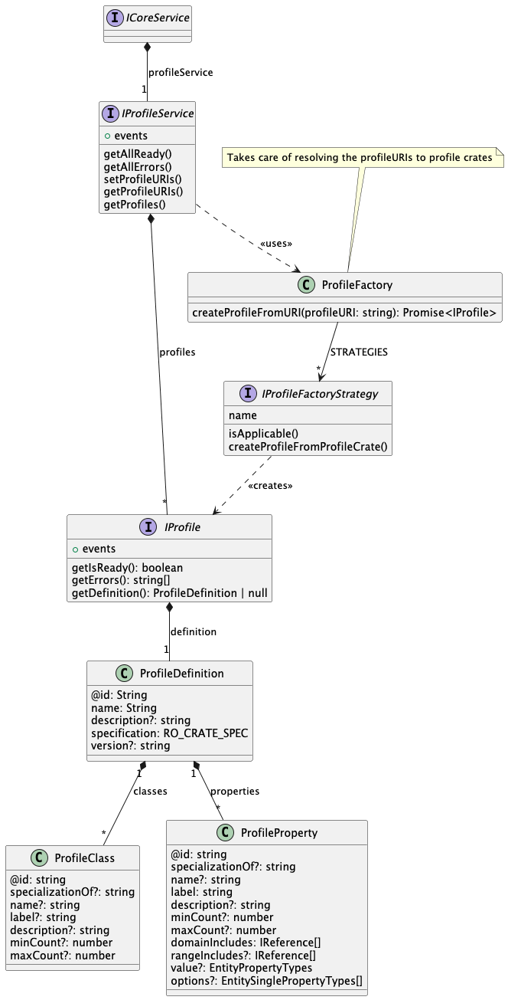

# NovaCrate Core Library Documentation

Documentation for the NovaCrate Core Library. This concerns all code in the `lib/core` folder. Not everything is documented yet.

The core of NovaCrate is split into two layers:
- Core Layer
- Persistence Layer

The Core Layer is the core of the application. It contains the most important services for the editor (MetadataService, ContextService, ProfileService)

The Persistence Layer handles the persistence of RO-Crates within the application. It is designed to be swappable, in order to deploy NovaCrate with multiple
different types of backends (e.g. local file system, browser file system (current), cloud repositories, etc.).

Data held in the core and persistence layer is the source of truth for the application.

## Overview

## Core Library

### Profiles Library
The Profiles Library is contained in the Core Library. See the [Profiles](./profiles.md) documentation.

## Persistence Library

See the [Persistence](./persistence.md) documentation