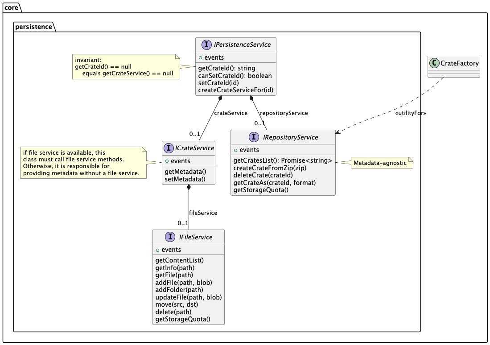

# Persistence

The persistence layer of NovaCrate (containing a PersistenceService and CrateService, optionally with a RepositoryService and FileService)
can be swapped out. The following implementations are available as part of NovaCrate:

- browser (Standalone OPFS-based Persistence)
- iframe (Limited Persistence for [IFrame usage](./iframe-interface.md))

The persistence layer is currently loaded based on the `[mode]` path variable of the Next.js page. To load the browser mode, use
`full`. For the IFrame mode, use `iframe` (see [IFrame usage](./iframe-interface.md))

Other implementations can be added by forking the NovaCrate repository and implementing the persistence interfaces (`/lib/core/persistence`) in a corresponding new folder (`/lib/persistence/<someName>`).
The persistence is provided through [PersistenceProvider](../components/providers/persistence-provider.tsx), based on the mode passed from the
layout where the provider is mounted. In the main menu the mode is unknown, and therefore the browser persistence is used as fallback. In the editor, the mode is known, and the appropriate persistence implementation is used.

Because the main menu is not bound to a specific persistence provider, multiple persistence providers could be used here, e.g. crates for all connected persistence providers can be displayed in the crate list.
When the user opens a crate, the corresponding persistence implementation is loaded in the editor. Note that as of now, only crates from the browser implementation are shown in the main menu.