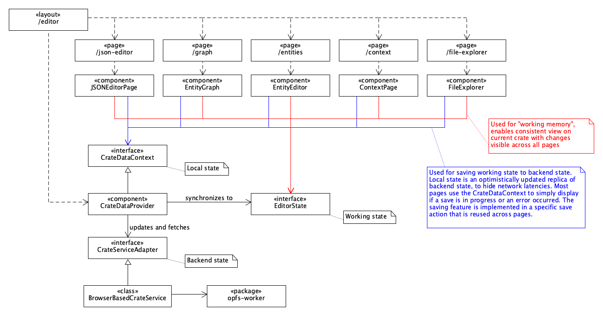
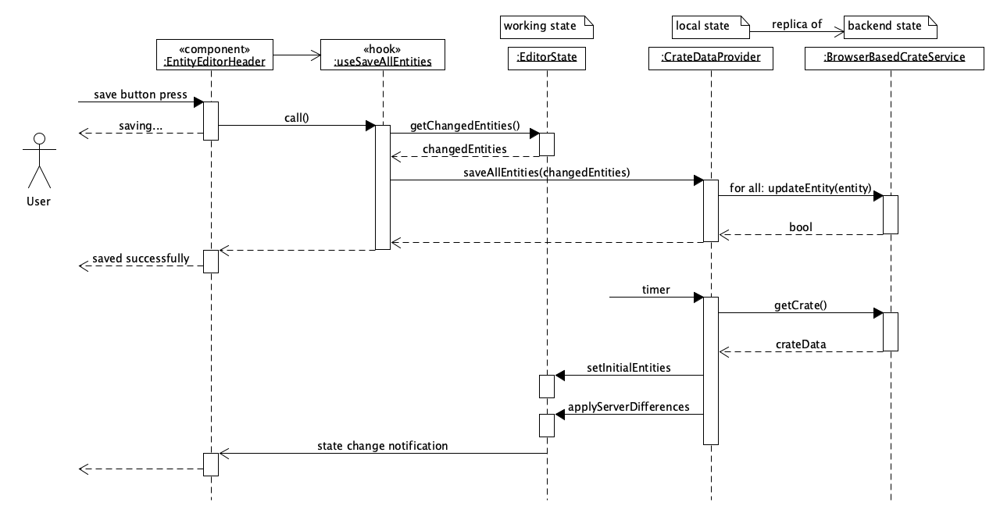
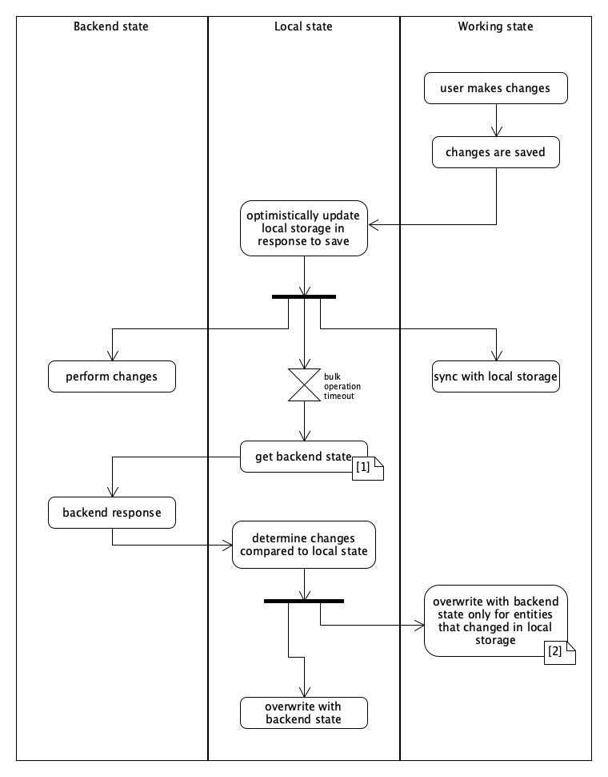

# State Management

In React every component is a function of its state. The visual appearance of a component (and also that of NovaCrate in its entirety) is determined by its state.
The behavior of NovaCrate can be boiled down to changing state based on user interaction. As such, the different states within NovaCrate are the core of the application.
In this document, the central states of NovaCrate will be outlined, showing their relationships to each other and their individual purpose. This is the most crucial step to 
understanding the NovaCrate architecture.

> NovaCrate's architecture follows the Model-View-Controller (MVC) pattern. 

## Central States

There are three central states within NovaCrate:
- Working state
- Local state
- Backend state

The working state is used in pretty much every interactive component of NovaCrate and thus is crucial for the operation. The local state is a replica of the backend state.

Shown in the figure is the interplay between the three states in the current implementation. Note that the pages only depend on the local state to show information on whether a 
backend-operation (like saving) is currently in progress or if any error occurred.

Most components do not need to depend on the local state and should just subscribe to the working state.

### Working State

> Implemented as EditorState

The working state contains all the information of the crate metadata file, such as its entities and context. Any changes made to the entities or the context through the editor are
immediately propagated to the working state. All components depending on the working state are re-rendered whenever the working state changes. This allows a high degree of interactivity and coherence within the editor.

Editing an entity on e.g. the entity explorer page will make the changes immediately visible in any other page of the editor.

Because working state changes and component re-renders are tightly coupled, the frequency of state changes is crucial for performance. Carefully sliced state hooks within components ensure that they only subscribe to state they
actually need to render. The frequency of state changes as well as the dependencies of components must be carefully monitored to ensure a smooth experience.

> NovaCrate implements deferred state updating to reduce the frequency of state changes. While typing text in a text input, the resulting state change is propagated to the working state in intervals of at least 200 ms, not on every keystroke. This results in a smooth typing experience while keeping the waiting time for global updates short.

### Local State

> Implemented as CrateDataProvider

The local state is a replica of the backend state. It is optimistically updated whenever an update is sent to the backend state (meaning the changes of the state update are applied immediately to the local state in many changes, even if then backend has not responded with the actual result of the operation yet. This is only done for operations where the outcome can easily be anticipated). 
The local state is used to remove network latencies in case of simple operations. It is also used to partially optimistically update the local state based on a state change that requires heavy work in the backend. The changes that result within the backend as part of the unanticipated heavy worked are silently merged into the local state once they are known.

This was originally implemented for a smooth REST-based editing experience, but is not needed for the current browser-based crate editing implementation. The local state was not removed, as a REST-based backend might be desired in the future, and because the current local state works as expected without issues. 

Most components do not need to depend on local state and should just subscribe to the working state. But the local state contains information on whether a backend-operation is currently in progress or if an error in the backend occurred.

### Backend State

> Implemented as BrowserBasedCrateService

The backend state refers to the content of the ro-crate-metadata.json file on the backend. Whenever the user saves their changes or performs a backend-dependent operation, the backend is sent a request. In response, the backend state is fetched and compared to the local state. Changes are then merged, with the backend state having precedence. 

In case of a conflict, data loss in the local state might occur. 

Conflicts between local and backend states are not expected to occur but cannot be prevented. The backend's behavior might be unexpected and might clash with the optimistic updates done in the local storage. In this case, either the optimistic updates in the local storage or the backend behavior should be adapted to prevent data loss.

### Synchronization of the central states

The working state is written to the local and the backend state whenever the user saves their changes. This is shown in the figure below.

The interactions between the three states are quite complex and almost cyclic. The next figure provides an overview over all possible synchronization paths.

[1] Getting the backend state can happen at any time. This is handled by a library in the background. This happens unprompted for example when focusing the browser after a longer time of inactivity.

[2] Backend state and local state should normally not mismatch. This can happen for the following reasons:
1. The changes performed by the backend do not match the optimistic update in the local state
2. The backend performed unexpected changes in other entities (side-effects, for example maintaining the hasPart property of the root entity)
3. The backend had changes not known to the local state (e.g. multiple users editing the same crate)

> The current synchronization strategy is not perfect and might lead to data loss in some cases. In the future the implementation should be replaced with an established library for collaborative real-time editing.
> This should be a simple feat, as the metadata of the crate can be stored in a single JSON text file or JSON object.